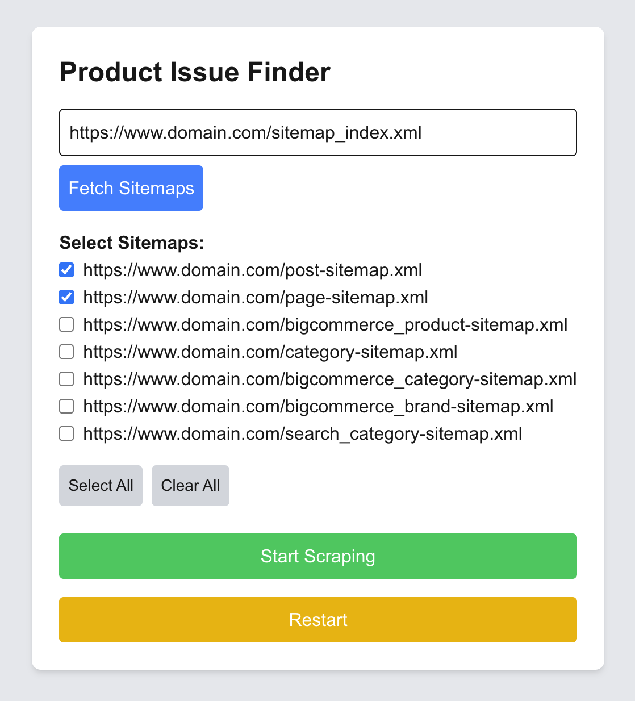
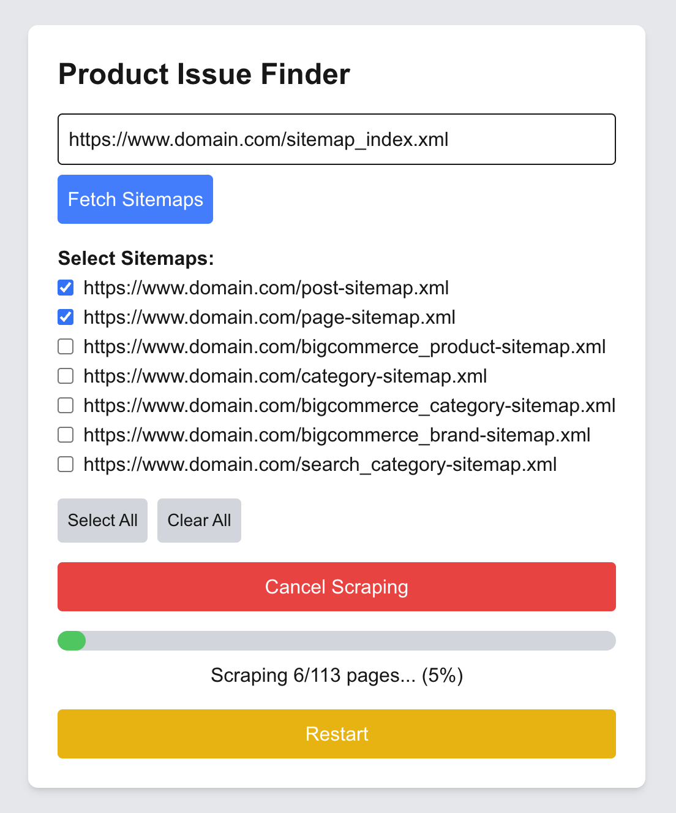
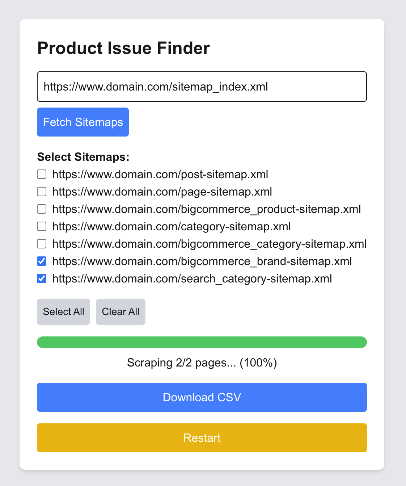

# Product Issue Finder

A dynamic monitoring tool that helps identify missing product information across any website using a sitemap. Designed for marketing and content teams to quickly audit product pages and ensure visual consistency.

Built with real-time progress tracking, seamless UI, and automatic CSV export — all powered by Puppeteer and Next.js.

<div style="display: flex; gap: 10px;">
  
  
  
  
  
  
</div>

---

## Description

This web app allows users to input their website's sitemap, fetch all discoverable sub-sitemaps, select the ones they want to scan, and scrape product pages for missing information. The scraping is done headlessly using Puppeteer and updates the UI with real-time progress using Server-Sent Events (SSE).

Once scraping is complete, a CSV file is generated and automatically downloaded with a list of product pages missing information (title, price, image, etc).

---

## Features

- Sitemap Fetching — Input your sitemap URL to automatically discover sub-sitemaps
- Sub-sitemap Selection — Pick only the sections you want to scrape
- Headless Scraping — Uses Puppeteer to render pages like a real browser
- Real-Time Progress Updates — Live feedback using Server-Sent Events (SSE)
- Instant CSV Export — Downloads a CSV file with missing information data (no file saving needed)
- Reset & Cancel Controls — Full control of scraping flow for better UX
- Production-Ready — Fully SSR with Bun + Next.js for fast deploys

---

## Technologies Used

- Next.js 15 (App Router)
- React (with Hooks)
- Puppeteer
- TypeScript
- TailwindCSS
- Bun (for dev/build/start)
- Server-Sent Events (SSE)

---

## Challenges Faced

### 1. Handling Dynamic Content
Most product images are loaded client-side with JavaScript. Traditional HTTP-based scrapers (like `axios` + `cheerio`) wouldn’t work. Puppeteer was used to fully render each page like a real browser.

### 2. Progress Feedback
I needed a way to communicate scraping progress to the user in real time. Server-Sent Events (SSE) offered a clean solution — lightweight and easy to integrate with React's state.

### 3. File Downloads in Production
Initially, the app saved CSVs to the `/public` folder, but in production this caused issues with static builds. I refactored to stream the CSV as a response instead, using `Blob` downloads in the browser — no file saving needed.

### 4. Canceling Long Tasks
Scraping large sites can take time. I added a shared cancel flag that lets users interrupt scraping safely, and the backend respects that flag mid-process.

### 5. Deploying Puppeteer on Vercel
Vercel’s serverless functions don’t support long-running or headless browser processes like Puppeteer out of the box. To avoid limitations, I opted to run the app on a traditional server environment using Bun and Next.js with Node compatibility. This ensured Puppeteer could run in a full environment without hitting memory or timeout issues.

---

## Getting Started

```bash
# Install dependencies (uses Bun)
bun install

# Run in dev mode
bun dev

# Build for production
bun run build

# Start production server
bun start
